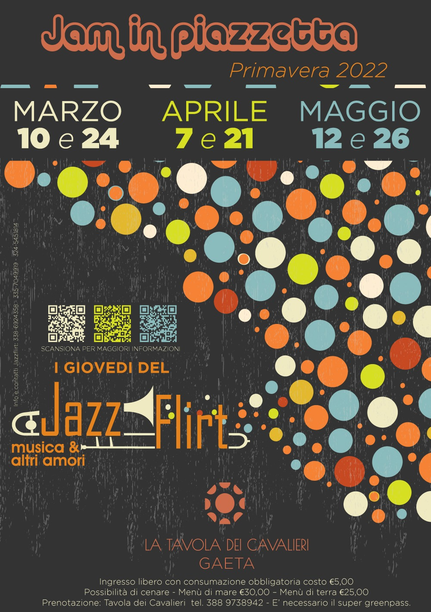

***MARZO***

Giovedì **10 marzo** ore 21,00 -Gaeta, La Tavola dei Cavalieri - **Simone Magliozzi Duo Jazz and BossaNova Jam session** (entrata libera con consumazione al bar obbligatoria - possibilità di cenare)

 

Giovedì **24 marzo** ore 21,00 - Gaeta, La Tavola dei Cavalieri – **Paolo Zamuner Trio -Jam session** (entrata libera con consumazione al bar obbligatoria - possibilità di cenare)

 ***APRILE***

Giovedì **7 aprile** ore 21,00 -Gaeta, La Tavola dei Cavalieri -**Tyron D’Arienzo Trio -Rockabilly** - **Jam session** (entrata libera con consumazione al bar obbligatoria - possibilità di cenare)

 Giovedì **21 aprile** ore 21,00 -Gaeta, La Tavola dei Cavalieri -**Gloria Trapani Trio -Jam session** (entrata libera con consumazione al bar obbligatoria - possibilità di cenare)

 ***MAGGIO***

 Giovedì **12 maggio** ore 21,00 -Gaeta, La Tavola dei Cavalieri -**Simone PannozzoPowerTrio**-**Il Funk** - **Jam session** (entrata libera con consumazione al bar obbligatoria - possibilità di cenare)

 Giovedì **26 maggio**ore 21,00 - Gaeta, La Tavola dei Cavalieri - **CyranoVatel Trio - Jazz Manouche-Jam session** (entrata libera con consumazione al bar obbligatoria - possibilità di cenare)

  ***Ingresso libero con consumazione obbligatoria costo €5,00***

***Possibilità di cenare - Menù di mare €30,00 – Menù di terra €25,00 – Prenotazione direttamente alla Tavola dei Cavalieri  tel. 388 9738942 –  E’ necessario il super greenpass.***

 

**Info e contatti Jazzflirt:**

**338-6924358 / 335-7049919 / 324-5451814**

