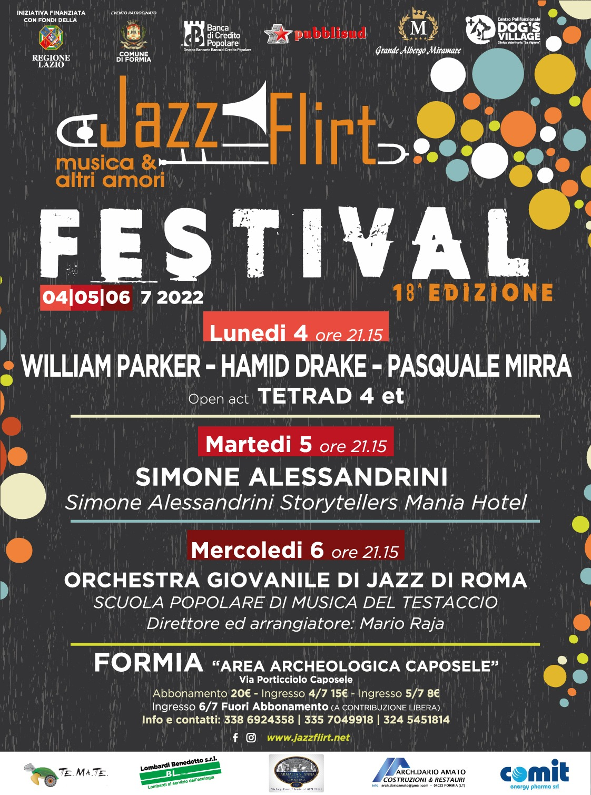

## Lunedi 4 luglio 2022 - ore 21.15

## **WILLIAM PARKER – HAMID DRAKE – PASQUALE MIRRA**

**WILLIAM PARKER    - contrabbasso;**

**HAMID DRAKE          - batteria;**

**PASQUALE MIRRA    - vibrafono**

**Open act**

## **TETRAD 4 et**

**Gianluca Manfredonia            - vibrafono**

**Armando Iacovella                 - chitarra**

**Alessandro Del Signore          - contrabbasso\
Alessandro Forte                    - batteria**

## **Martedi 5 luglio 2022 - ore 21.15**

## **SIMONE ALESSANDRINI**

**Simone Alessandrini Storytellers Mania Hotel**

**Simone Alessandrini**            – alto sax, karaoke toy, chitarra

**Antonello Sorrentino**            – trumpet

**Federico Pascucci**                – tenor sax, turkish clarinet

**Riccardo Gola**                       – double bass, synth bass

**Riccardo Gambatesa**            – drums, percussion

## **Mercoledì 6 luglio 2022 - ore 21.15**

## Orchestra giovanile di jazz del Testaccio

## diretta dal Maestro Mario Raja.

**Per info e prenotazioni chiamare ai numeri 3386924358 – 3357049918 - 3245451814 oppure inviateci una e-mail all’indirizzo info@jazzflirt.net**

**Seguici su Facebook ed Instagram**

